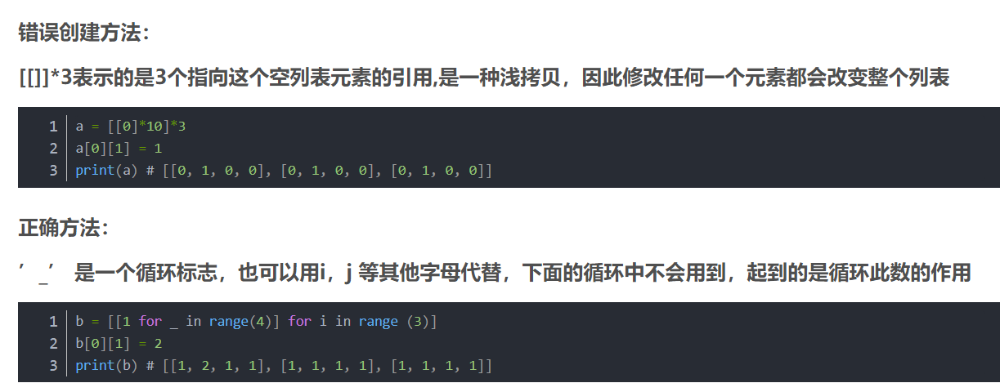

# LeetCode
this rep is used to record my daily LeetCode pratice,i hope i will stand on ...

# 2022-07-27开始重拾刷力扣题

应该是只记录python版本的代码吧。。。之前写的很多C++版本的代码没有记录，以后如果闲了的话再说吧:)
对于属于不同类别的题型，我将根据我做这个题的时候想要训练的那个方面去分它应该去的文件夹

# 名词解释
## 1.字典序

字典序是指从前到后比较两个字符串的大小。首先比较第一个字符，如果不同则第1个字符较小的字符串更小，如果相同则比较第2个字符……如此继续，来比较整个字符串的大小


## 2.子串，子数组

子X是连续的，**一旦说子串或者子数组，就看开头的情况下是啥或者结尾的情况下是啥，只要知道，问题就结了。**比如说，子串必须以i位置的字符结尾，它最长的有效括号子串多长，那么以0,1,2,...n-1结尾都有一个答案，那么最终答案就是上面的n个答案种最大的。


# Tricks

1. 使用预处理数组来优化。
2. 根据数据量反推方法，如果N=10 ** 6，那么肯定不能是N ** 2 的方法
3. 好的笔试是不会考常数时间的。
4. 面试的时候可以套路面试官，数据范围是什么样的？等等
4. 优化问题能从两个地方着手，一个是从数据，另外一个从题目的理解上。

# 贪心

#### [1605. 给定行和列的和求可行矩阵](https://leetcode.cn/problems/find-valid-matrix-given-row-and-column-sums/)这个题很有意思


# 栈

#### [1047. 删除字符串中的所有相邻重复项](https://leetcode.cn/problems/remove-all-adjacent-duplicates-in-string/)这个题很有意思。我没有想到栈能写。。


# 二分法
## 1.查找数字

这个不说了。


## 2.查找某个索引i,在i之后的元素满足条件
比如1351题，统计有序矩阵中的负数

## 3.找两个数的和为一个目标值
剑指 Offer II 006. 排序数组中两个数字之和  这个题，具体做法是先固定一个，然后算另外一个（for循环可以)

# 前缀和
剑指 Offer 66. 构建乘积数组  这个题是一个很基础的题，理解这个，就对前缀和有很多的理解了。


# 非基于比较的排序
桶排序可以好好研究一下164题，计数排序1051题,1122题


# 链表
《剑指 Offer 22. 链表中倒数第k个节点》  这一题可以通过快慢指针做，很有趣

# 树
## 二叉搜索树

[938. 二叉搜索树的范围和](https://leetcode.cn/problems/range-sum-of-bst/)这个简单的题很适合理解

## 二叉树

[513. 找树左下角的值](https://leetcode.cn/problems/find-bottom-left-tree-value/)这个题可以通过入栈顺序优化，我没有优化

[652. 寻找重复的子树](https://leetcode.cn/problems/find-duplicate-subtrees/)这个题直接查看了答案，然后我看的那个答案说的很有道理，他说后序遍历比前序遍历更快。

## LCA问题（最近公共祖先)


# 并查集
比较经典的几个题：
* 200.岛屿数量
* 547.省份数量
* 695.岛屿的最大面积

# Others
## 384.打乱数组
这个题是Fisher-Yates 洗牌算法，然后一点就是要注意拷贝。


## 398.随机数索引
这个题是水塘抽样和哈希表的一个经典的题。不过看起来python版本的水塘抽样超时。。。
382题也是一个很典型很简单的水塘抽样的题

## 667. 优美的排列 II
脑筋急转弯的问题。

## 一些简单但有趣的题
### 290.单词规律
这个题和205同构字符串很相同，可以通过set的方式很快的得到结果
还有一个348题，都是类似的。


### 973.最接近原点的K个点
这个题我看答案的题解，，让我重新认识了lambda函数和排序函数。。哎，太菜了


### 1925.统计平方和三元组的数目
这个题你做做试试！我现在是抄答案的。

### 1.两数之和
注意这个题用hashmap加速版很有趣的。

### 1652. 拆炸弹
循环==滑动窗口+指针取模

# python技巧
1. 用[:]表示重新分配了内存给新的列表变量
## python双数组排序
下面代码是按照频率排序，如果频率一样，就按照数值的大小进行降序

```python
        mycounter = collections.Counter(nums)
        keys,values = zip(*sorted(zip(list(mycounter.keys()),list(mycounter.values())), key=lambda x:(x[1],-x[0])))
```

# 容易犯的错误
1. 边界条件，这个老生常谈了，应该要多上心
2. 在进行一些，制作字符串字典类似的题的时候，注意当循环结束的时候，要判断word是否为空，比如下面的代码,for循环结束后的if判断还是很重要的：
```python

words = "hello word"
word = ""
mydict = {}
for c in words:
    if word == " ":
        mydict[word] = 1
        word = ""
    else:
        word +=c
if word !="":
    mydict[word] = 1


```
3. 创建二维数组的时候浅拷贝的问题:

正确的代码：
```python
b = [[1 for _ in range(4)] for i in range (3)]
b[0][1] = 2
print(b) # [[1, 2, 1, 1], [1, 1, 1, 1], [1, 1, 1, 1]]

```
4. 求最大公约数的代码：
```python
    def gcd(m,n):
        """
        要保证m,n都不为0
        """
        return m if n == 0 else gcd(n,m% n )

```


# 其他闲谈
今天是2022.07.29-20：17，到现在写了40个题，虽然很多简单难度的，但是今天好喜欢刷题:)
